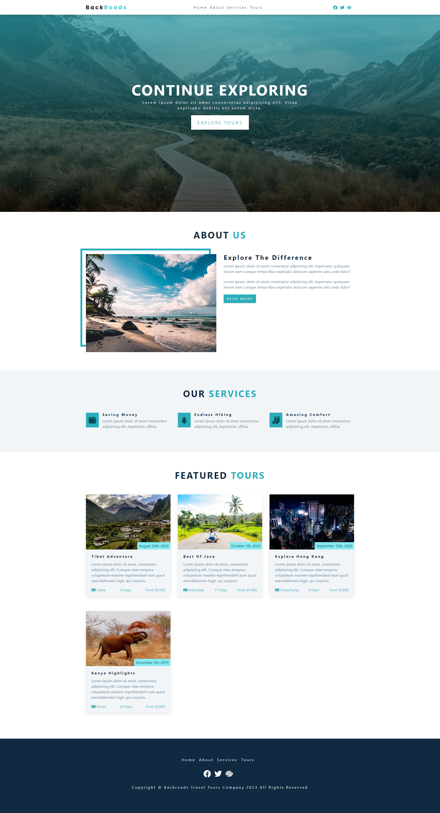

# Backroads App Refactor

## Description

This project was aimed at practicing refactoring existing code into a react.js app. This challenge had a singular purpose of getting me more comfortable working with react.js. This is my first time working with the React library and future iterations will be refactoring a project I did myself and creating new projects from scratch using the React.js library.

Homepage:

## Table of Contents

- [Installation](#installation)
- [Usage](#usage)
- [License](#license)
- [Contributing](#contributing)
- [Test](#test)
- [Questions](#questions)
- [Credit](#credit)

## Installation

### Programs needed for this project:

- GitBash (windows) or Terminal (Mac)
- Node.js

Locate a suitable place where you would like to download this repository. Once found, copy the repositories SSH or HTTPS to clone through the terminal or download the zipfile from GitHub. After it is downloaded, please ensure that node.js is installed. Once it is installed and at least version 18 or higher, go to your terminal, navigate to the directory that contains this repository. Once there, type in "npm i" to download the required dependencies.

Once all dependencies are downloaded, enter "npm start". It should launch your default browser to http://localhost:3000 to show the live application.

## Usage

This repository is allowed for use in a learning environment to evaluate and analyze.

## License

    Please see the MIT license found in the repository. To learn more, please click the license badge at the top of the README.MD

## Contributing

- John Smilga for instructions from his Udemy course: [React 18 Tutorial and Projects Course (2023)](https://www.udemy.com/course/react-tutorial-and-projects-course/)

## Questions

If you have further questions about this project, please send an email or checkout us out on GitHub.

Email: kyleochata@gmail.com

GitHub Link: https://github.com/kyleochata

## Credit

This project was created by Kyle Etrata
